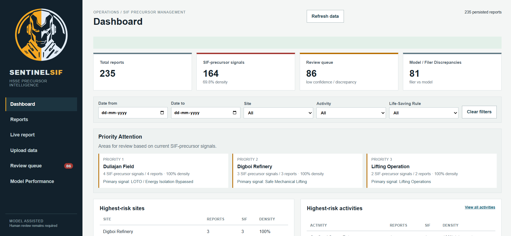
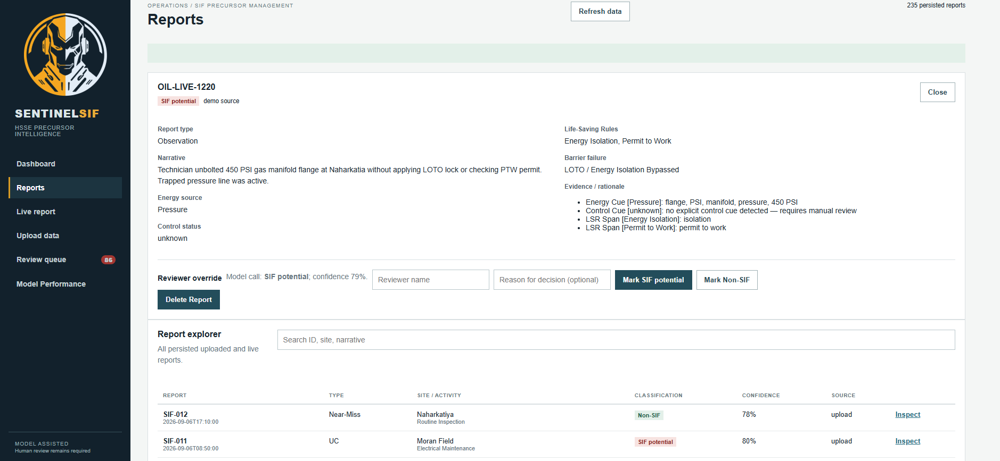
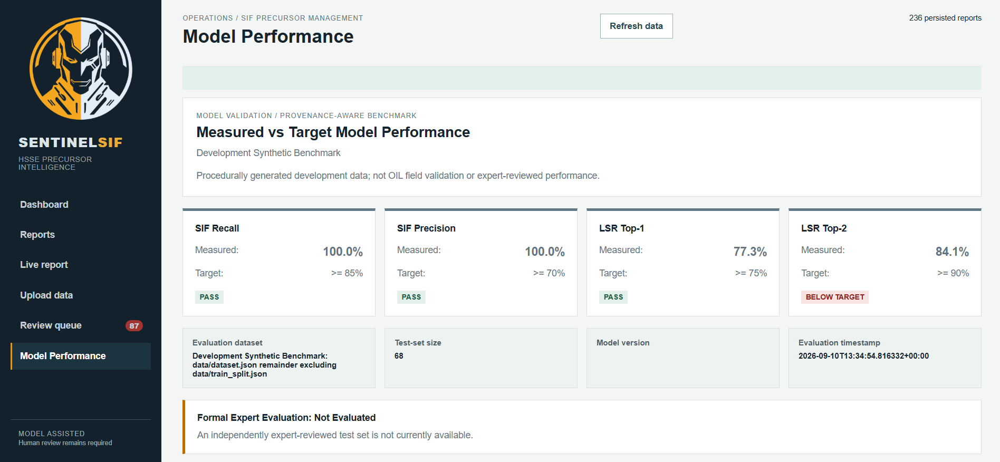

# SentinelSIF

### AI/NLP Engine for Detecting Serious Injury & Fatality (SIF) Precursors in HSSE Reports


SentinelSIF is an explainable AI/NLP decision-support engine designed to identify Serious Injury & Fatality (SIF) precursors hidden within Unsafe Act (UA), Unsafe Condition (UC), near-miss, and incident reports.



Instead of relying primarily on reported injury severity, SentinelSIF evaluates the combination of:

> **High-energy exposure + failed, absent, or ineffective direct control**

This enables HSE teams to identify reports that describe potentially life-threatening situations, prioritize them for review, and discover recurring precursor patterns across sites, activities, energy sources, and safety controls.

The system is being developed as a **Smart India Hackathon (SIH) 2026 prototype** by Team Sentinels for Problem Statement No. **SIH26165**.

# Quick Acess

[Getting Started](https://github.com/MnSykia/Sentinel_SIF#getting-started) | [Features](https://github.com/MnSykia/Sentinel_SIF#features-1) | [FAQ](https://github.com/MnSykia/Sentinel_SIF#faq)

---

## Problem

Large HSSE reporting systems can contain substantial volumes of free-text Unsafe Act, Unsafe Condition, near-miss, and incident narratives. Manual review of these narratives at periodic intervals can create a visibility gap: a report recorded as "Low" or "Medium" severity may still describe a situation with the potential to cause a fatality or life-altering injury.

SentinelSIF addresses this gap by automatically analyzing report narratives and surfacing the situations and recurring patterns that warrant HSE attention.

The system focuses on three core outcomes:

1. **SIF-Potential Classification**

   * Classifies reports as SIF-potential or Non-SIF-potential.
   * Prioritizes high recall because missed SIF precursors can carry greater safety consequences.

2. **Life-Saving Rule Tagging**

   * Maps relevant reports to applicable IOGP Life-Saving Rules.

3. **Precursor Pattern Intelligence**

   * Identifies recurring patterns across:

     * Sites
     * Activities
     * Energy sources
     * Barrier/control failures
     * Life-Saving Rules

The dashboard emphasizes **SIF-precursor density** rather than raw report volume, helping HSE teams identify where fatal-potential exposure is concentrated.

---

## Key Concept

A SIF precursor is not defined by the severity of the outcome. SentinelSIF focuses on situations where a high-energy source is present and the direct control intended to manage that energy is absent, ineffective, or not followed.



Examples of high-energy exposure include:

* Electrical energy
* Stored or pressurized energy
* Mechanical energy
* Gravity / elevation
* Vehicle kinetic energy
* Chemical / thermal energy
* Hydrocarbon-related energy

Examples of direct controls include:

* Energy isolation / LOTO
* Guarding
* Permit to Work
* Gas testing
* Fall protection
* Exclusion zones
* Lifting plans
* Required PPE
* Safe operating procedures

The **energy + control** approach forms the core decision logic of SentinelSIF. Filer-selected severity is treated as contextual information rather than ground truth.

---

## Features

### AI/NLP Classification

SentinelSIF analyzes free-text HSSE narratives using a hybrid approach combining:

* Sentence-Transformer semantic embeddings
* Logistic Regression classification
* Energy-source detection
* Direct-control detection
* Rule and taxonomy logic

The hybrid architecture combines semantic NLP with explicit safety-domain reasoning rather than relying on an opaque LLM-only decision.

### Explainable AI

Each analyzed report can expose:

* Detected energy source
* Control/barrier status
* Evidence spans
* Life-Saving Rule
* Precursor category
* Decision rationale
* Confidence score

The objective is not simply to produce a classification, but to show an HSE reviewer **why the report was flagged**. Confidence is a decision-support signal. It must not be interpreted as measured model accuracy.

### IOGP Life-Saving Rules

SentinelSIF supports tagging against the following 10 IOGP Life-Saving Rules:

* Bypassing Safety Controls
* Confined Space
* Driving
* Energy Isolation
* Hot Work
* Line of Fire
* Safe Mechanical Lifting
* Management of Change
* Permit to Work
* Working at Height

### Precursor Pattern Detection

The system extracts and aggregates recurring patterns across:

* Site
* Activity
* Energy source
* Barrier-failure category
* Life-Saving Rule

### Risk-Concentration Dashboard

The dashboard provides:

* SIF-precursor density rankings
* Site risk concentration
* Activity rankings
* Life-Saving Rule distribution
* Barrier-failure patterns
* Trends over time
* Report-level drill-down
* Discrepancy detection
* Human-review queue

Sites and activities are ranked using SIF-precursor density alongside absolute report counts so that high-volume locations do not automatically dominate the analysis simply because they submit more reports.

### Human-in-the-Loop Review

Low-confidence cases and model/filer discrepancies can be reviewed by an HSE user.

Reviewers can:

* Inspect the original narrative
* Examine model evidence
* Accept or override the classification
* Add reviewer notes
* Preserve override history

Human corrections are retained as labelled examples that can support future model refinement.

### Source-Agnostic Ingestion

SentinelSIF is designed as a source-agnostic intelligence layer rather than a replacement for an existing HSSE platform.

Reports can be supplied through:

* CSV
* JSON
* REST API
* Live Report form

A documented ingestion schema allows an existing or future HSSE platform to map exported data into SentinelSIF without requiring platform-specific assumptions.

---

## Technology Stack

| Layer              | Technology                                |
| ------------------ | ----------------------------------------- |
| Frontend           | HTML5, CSS3, Vanilla JavaScript           |
| Backend            | Python, FastAPI                           |
| API Server         | Uvicorn                                   |
| NLP                | Sentence-Transformers                     |
| Embedding Model    | `all-MiniLM-L6-v2`                        |
| ML Classifier      | scikit-learn Logistic Regression          |
| Safety Logic       | Custom rule + taxonomy engine             |
| Data Processing    | Pandas, NumPy                             |
| Validation         | Pydantic / FastAPI                        |
| Prototype Database | SQLite                                    |
| Architecture       | REST API                                  |
| Explainability     | Evidence spans + energy/control rationale |

The architecture follows a lightweight REST-based design with a Python NLP pipeline, relational prototype store, analytics aggregation, dashboard, and human-review feedback loop.

---

## Architecture

```text
                    HSSE Reports
                         │
             ┌───────────┴───────────┐
             │                       │
          CSV / JSON            Live Report
             │                       │
             └───────────┬───────────┘
                         │
                  Ingestion Layer
                         │
                  Validation /
                   Normalization
                         │
                         ▼
                NLP Preprocessing
                         │
          ┌──────────────┼──────────────┐
          │              │              │
          ▼              ▼              ▼
    Energy Detector  Control Detector  Semantic
                                      Classifier
          │              │              │
          └──────────────┼──────────────┘
                         ▼
                  SIF Decision Engine
                         │
          ┌──────────────┼──────────────┐
          ▼              ▼              ▼
       Evidence        LSR Tags      Precursor
       Extraction                     Patterns
          │              │              │
          └──────────────┼──────────────┘
                         ▼
                 Persistence Layer
                         │
                         ▼
               Analytics / Dashboard
                         │
          ┌──────────────┴──────────────┐
          ▼                             ▼
     HSE Review                    Risk Intelligence
          │
          ▼
     Human Override
          │
          ▼
    Labelled Feedback
```

---

## Model Evaluation



The SIH prototype defines the following target metrics:

| Metric             | Prototype Target |
| ------------------ | ---------------: |
| SIF Recall         |            ≥ 85% |
| SIF Precision      |            ≥ 70% |
| LSR Top-1 Accuracy |            ≥ 75% |
| LSR Top-2 Accuracy |            ≥ 90% |

These targets are separate from measured results.

SIF Recall is:

```text
TP / (TP + FN)
```

SIF Precision is:

```text
TP / (TP + FP)
```

LSR Top-1 is counted as correct when the highest-ranked predicted Life-Saving Rule is present in the ground-truth set.

LSR Top-2 is counted as correct when at least one of the two highest-ranked predicted rules is present in the ground-truth set.

The evaluation does not use filer-selected severity as ground truth.

**Confidence scores are decision-support signals and must not be interpreted as measured model accuracy.**

### Evaluation Data Provenance

Real OIL HSSE data was not available to the development team for this prototype.

The checked-in:

```text
data/dataset.json
```

contains synthetic development data generated by:

```text
data/dataset_generator.py
```

It is not real OIL HSSE data, field-validation data, or independently expert-reviewed data. Its `ground_truth` fields are generator metadata used for controlled development benchmarking.

### Development Synthetic Benchmark

The current quantitative prototype benchmark uses the records in `data/dataset.json` whose stable `report_id` values are absent from:

```text
data/train_split.json
```

The current demo dataset contains 222 records, with 154 records in the training split and 68 records in the synthetic held-out benchmark.

These benchmark results demonstrate prototype behavior only. The benchmark is intended to demonstrate that the complete classification and tagging pipeline can be quantitatively evaluated on controlled development data.

### Formal Expert-Reviewed Evaluation

Formal evaluation is intentionally separate from the synthetic benchmark. The evaluation infrastructure supports:

```text
data/expert_reviewed_test.json
```

A valid formal evaluation dataset must contain, at minimum:

```text
report_id
timestamp
report_type
site
activity
narrative
ground_truth_sif
ground_truth_lsr
annotation_status
annotator_count
source_reference
reviewed_at
```

Formal evaluation requires independently supplied expert-reviewed labels. The evaluator validates required fields, report-ID uniqueness, ground-truth types, Life-Saving Rule values, provenance metadata, and training/test leakage. 

Until a genuinely independent expert-reviewed dataset is available:

> **Formal Expert Evaluation: Not Evaluated**

Synthetic benchmark results and formal expert evaluation are deliberately kept separate.

---

## Human-in-the-Loop Workflow

```text
Report Submitted
       │
       ▼
AI/NLP Analysis
       │
       ▼
SIF Classification
       │
       ├──────── High Confidence ───────► Dashboard
       │
       └──────── Low Confidence /
                 Discrepancy
                       │
                       ▼
                 Human Review
                       │
                 ┌─────┴─────┐
                 ▼           ▼
              Accept      Override
                 │           │
                 └─────┬─────┘
                       ▼
                 Final Decision
                       │
                       ▼
              Labelled Feedback
```

The original model output and subsequent human override are retained separately so that reviewer decisions remain auditable. Human corrections can provide labelled examples for future model refinement.

---

## Getting Started

### 1. Clone the repository

```powershell
git clone https://github.com/<YOUR-USERNAME>/SentinelSIF.git
cd SentinelSIF
```

### 2. Create a virtual environment

```powershell
python -m venv .venv
```

### 3. Activate the environment

```powershell
.\.venv\Scripts\Activate.ps1
```

If PowerShell blocks script execution:

```powershell
Set-ExecutionPolicy -ExecutionPolicy RemoteSigned -Scope CurrentUser
```

Then activate the environment again.

### 4. Install dependencies

```powershell
pip install -r requirements.txt
```

### 5. Configure environment variables

Copy:

```text
.env.example
```

to:

```text
.env
```

The application can run with its default local configuration.

Default prototype database:

```text
data/sentinelsif.db
```

Default local address:

```text
http://127.0.0.1:8000
```

### 6. Start the application

```powershell
uvicorn app:app --reload --host 127.0.0.1 --port 8000
```

Open:

```text
http://127.0.0.1:8000
```

---

## Data Ingestion

SentinelSIF accepts CSV and JSON reports using the following canonical fields:

```text
report_id
timestamp
report_type
site
activity
narrative
filer_selected_severity
```

Common field aliases are normalized at the API boundary.

Example:

```csv
report_id,timestamp,report_type,site,activity,narrative,filer_selected_severity
SIF-001,2026-09-10T09:30:00+05:30,UA,Duliajan Field,Wellhead Maintenance,"LOTO was not verified before opening the equipment and stored pressure remained in the line.",Low
```

The `filer_selected_severity` field is used as a comparison/context signal, **not as expert ground truth**.

---

## API

### Report Management

```text
POST /api/reports/upload
```

Upload CSV or JSON reports.

Returns imported records, duplicates, and validation failures.

```text
POST /api/reports
```

Submit a single live report.

```text
GET /api/reports
```

Retrieve report explorer data.

```text
GET /api/reports/{report_id}
```

Retrieve detailed analysis for a report.

```text
POST /api/reports/{report_id}/override
```

Persist a human reviewer classification decision.

```text
DELETE /api/reports/{report_id}
```

Delete a report and its associated review history.

### Data Management

```text
POST /api/data/clear-all
POST /api/data/clear-uploaded
POST /api/data/clear-live
POST /api/data/reset-demo
```

These endpoints manage persisted prototype reports. They do not delete the model-development or evaluation datasets.

### Dashboard

```text
GET /api/dashboard/summary
GET /api/dashboard/density
GET /api/dashboard/life-saving-rules
GET /api/dashboard/barrier-failures
GET /api/dashboard/trends
```

These endpoints provide the data used by the dashboard's operational analytics.

### Model Evaluation

```text
GET /api/evaluation
```

Returns evaluation information with explicit dataset provenance.

The evaluation layer supports:

* SIF Recall
* SIF Precision
* Life-Saving Rule Top-1 Accuracy
* Life-Saving Rule Top-2 Accuracy
* Test-set size
* Model version
* Evaluation timestamp
* Target comparison
* Evaluation provenance and validation status

---

## Operational Security and Storage

The current prototype uses SQLite for local/persistent demonstration storage.

The environment variable:

```text
SENTINELSIF_DATABASE_URL
```

is currently interpreted as a filesystem path to the SQLite database. It is not a SQLAlchemy-style database connection URL.

The prototype currently does not implement authentication or authorization for report deletion, data-clearing, demo-reset, or reviewer-override endpoints. These endpoints are intended for controlled local/demo use.

Before production deployment, these operations must be protected with appropriate authentication, authorization, role-based access control, and audit controls.

Do not expose the prototype database or destructive endpoints directly to an untrusted public environment.

---

## Security and Configuration

Do not commit secrets or local runtime data.

The following should remain outside version control:

```text
.venv/
venv/
.env
*.db
*.sqlite
*.sqlite3
__pycache__/
.vscode/
```

The `data/` directory itself should not be ignored because legitimate development datasets and dataset definitions are part of the project.

Use `.env.example` to document configuration without exposing credentials.

---

## Project Structure

```text
SentinelSIF/
├── app.py
├── evaluation.py
├── evaluate.py
├── requirements.txt
├── README.md
├── .env.example
│
├── sentinelsif/
│   ├── classifier.py
│   ├── preprocessor.py
│   ├── energy_detector.py
│   ├── control_detector.py
│   ├── lsr_tagger.py
│   └── precursor_extractor.py
│
├── data/
│   ├── dataset.json
│   ├── train_split.json
│   ├── dataset_generator.py
│   └── expert_reviewed_test.json
│
├── static/
│   └── ...
│
├── templates/
│   └── index.html
│
└── tests/
    └── ...
```

The runtime SQLite database is intentionally excluded from version control.

---

## Roadmap

Post-hackathon development can extend SentinelSIF with:

* Integration with OIL's selected HSSE data source
* Independently expert-reviewed evaluation using appropriate operational data
* Automated model retraining
* Leading-indicator risk scoring
* Guided report-filing prompts
* Mobile-first filing assistance
* Production authentication and role-based access control
* PostgreSQL or another managed production database
* Industry benchmarking against appropriate SIF exposure-rate baselines

These are future extensions and are not represented as capabilities of the current SIH prototype.

---
# FAQ

## Why not use an LLM?
An LLM could classify the text, but an LLM-only decision pipeline makes deterministic safety logic and auditability harder to guarantee. Our architecture explicitly decomposes the decision into energy, control status, semantic ML probability and evidence. LLMs can still be useful later as a supporting component for annotation, novel narratives or reviewer assistance.

## Isn't this just keyword matching?
**No.**
Keywords are one component of the safety-domain layer, but semantic embeddings and the ML classifier help identify semantically similar descriptions that may use different wording. For example, "LOTO was bypassed," "equipment was not isolated," and "energy remained live" may express related safety conditions without sharing identical wording.

## What confidence threshold are you using?
The current prototype has a default review threshold of 0.55. For the specific unknown-control decision branch, the implemented ML threshold is 0.60.These are decision parameters, not claims of accuracy.

## Why is your dataset synthetic?
Because real OIL HSSE data was not available to the team during the hackathon. Rather than imply otherwise, we clearly separate synthetic development data from future expert-reviewed validation. The architecture itself is source-agnostic, so the model can be retrained and evaluated once appropriate OIL data is available.

## How do you know your synthetic data is realistic?
The dataset is designed around operational contexts, energy sources, control failures and SIF/non-SIF distinctions reflected in the safety framework. But synthetic data is still a limitation. It demonstrates the system pipeline and methodology, not real-world OIL generalization.
**That is why independent expert review is the next validation step.**

---

# Project Status

**Smart India Hackathon 2026 Prototype**

SentinelSIF is a hackathon prototype demonstrating the feasibility of an explainable, source-agnostic SIF precursor intelligence layer for an HSSE reporting ecosystem.

The current prototype uses synthetic development data because real OIL HSSE data was not available to the development team. Quantitative synthetic benchmark results are provided to demonstrate prototype evaluation, while formal expert-reviewed evaluation remains unavailable until an independently labelled dataset can be obtained.

SentinelSIF is not a production safety system and must not be used as the sole basis for operational safety decisions.
